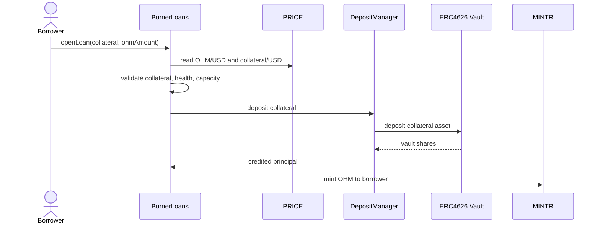
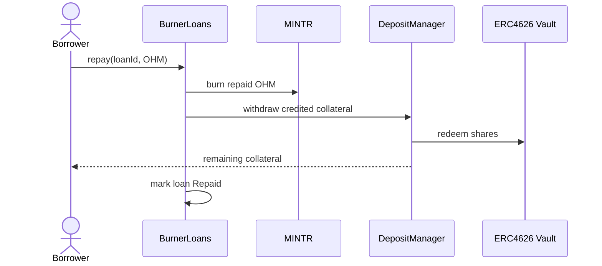
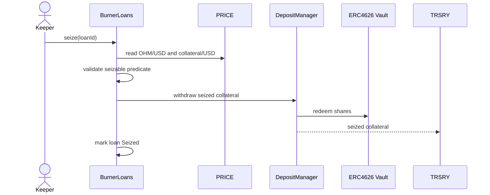
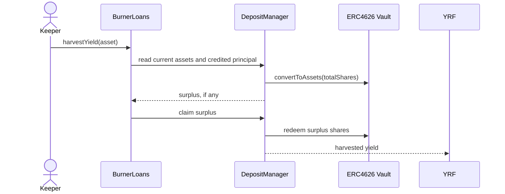

# Burner Loans Design

## Overview

`BurnerLoans` is a fixed-term, 0% OHM shorting facility. Borrowers deposit approved collateral, borrow newly minted OHM, and may sell that OHM externally. Repaid OHM is burned. If a loan becomes seizable, collateral is seized to `TRSRY`, the loan is closed, and unrepaid OHM remains circulating but backed by the seized collateral.

The design goal is to make shorting OHM self-funding for the protocol. Collateral yield routes to protocol repurchases, while backing-based collateral requirements make shorting near backing increasingly capital-inefficient.

## Process Diagrams

### Open Loan Sequence



### Repay Loan Sequence



### Seize Loan Sequence



### Harvest Yield Sequence



## Core Mechanics

### Opening

For v1, collateral should be USDS deposited into sUSDS.

A loan can open only if:

```text
riskAdjustedCollateralUsd >= max(
    debtValueUsd * minCollateralRatio,
    debtOhm * backingPerOhmUsd * backingMultiplier
)
```

Example:

```text
market requirement = 20 * 1,000 * 1.15 = 23,000 USD
backing requirement = 11.33 * 1,000 * 1.5 = 16,995 USD
required collateral = 23,000 USD
```

The market requirement protects repayment solvency. The backing requirement prevents new OHM from reducing liquid backing per backed OHM when OHM trades near backing.

### Repayment

The borrower repays OHM, and all repaid OHM is burned immediately. Repayment must not depend on collateral price, vault conversion rate, loan health, or seizable status. A borrower should always be able to close by returning OHM.

Returned collateral is the remaining credited principal, subject to vault loss or collateral impairment.

### Seizure

A loan is seizable if it is active, breaches the seizable threshold, and required PRICE inputs are fresh. `Seizable` is a derived predicate, not a stored state.

On seizure, collateral is sent to `TRSRY`, the loan is marked `Seized`, and unrepaid OHM remains circulating. This is first-party default liquidation by collateral seizure, not third-party debt purchase.

Third parties may execute seizure as keepers and receive a capped reward. The protocol still receives the seized collateral.

### Terms

Loans have 0% interest but fixed maturity. At expiry, a borrower can repay, extend if current requirements are met, or become seizable.

The fixed term prevents perpetual 0% shorts from consuming capacity indefinitely. Fees should be capacity fees, charged at origination and extension:

```text
feeBps = baseFeeBps + utilizationFeeBps
```

For v1, use one dynamic lever: utilization-based fees. Keep collateral ratios and max terms as governance-set, timelocked parameters.

## Collateral Accounting

Burner Loans collateral should be isolated from convertible deposits. The subgraph should index backing-eligible balances by facility and manager, not by all `DepositManager` balances.

Use either:

- A dedicated Burner Loans `DepositManager`.
- Equivalent custody and principal accounting inside `BurnerLoans`.

The existing `DepositManager` assumes monotonically increasing vault value in places. That is not sufficient here because ERC4626 vaults can suffer losses and redeem for less than credited principal. Either `DepositManager` must support non-monotonic vault accounting, or `BurnerLoans` must implement that accounting directly.

For each collateral pool:

```text
currentAssets = vault.convertToAssets(totalSharesHeld)
creditedPrincipal = total credited borrower collateral
surplus = max(0, currentAssets - creditedPrincipal)
shortfall = max(0, creditedPrincipal - currentAssets)
```

Borrower collateral credit is principal-denominated:

```text
borrower deposits 100 USDS
shares later redeem for 101 USDS -> borrower credit remains 100 USDS, 1 USDS is protocol yield
shares later redeem for 98 USDS -> borrower effective collateral is impaired to 98 USDS
```

Shortfalls are allocated pro rata across loans for the same collateral/operator pool. This avoids assigning losses to the last withdrawer.

Harvestable yield is only surplus over credited principal:

```text
harvestable = max(0, currentAssets - creditedPrincipal)
```

No harvest buffer is required if the implementation uses current redeemable assets, credits principal separately, rounds harvests down, and never lets yield improve borrower health.

## Pricing

Risk checks use USD as the unit of account via PRICE:

```text
collateralValueUsd = effectivePrincipal * collateralUsdPrice
debtValueUsd = borrowedOhm * ohmUsdPrice
```

Do not assume USDS is worth $1. If USDS depegs, collateral value changes.

Oracle tests should cover stale prices, collateral depegs, OHM gaps, ERC4626 share-rate loss, share-rate manipulation, moving-average divergence, PRICE configuration changes, and rounding at open, extend, repay, and seize thresholds.

For borrower-favorable actions, conservative pricing may be used where configured:

```text
priceForOpenOrExtend = min(currentPrice, movingAveragePrice)
```

For seizure, do not rely only on a slow moving average. Seizure needs fresh current prices.

## Collateral Configuration

Volatile collateral should be supported by the data model, but not enabled at launch. Volatile conversion to stable backing is out of scope for `BurnerLoans`; another policy can handle that after seizure if needed.

Each collateral asset should define:

```text
enabled
collateralFactorBps
minCollateralRatioBps
assetDebtCap
maxTerm
yieldEnabled
```

`collateralFactorBps` is a haircut applied after USD valuation:

```text
rawCollateralValueUsd = effectivePrincipal * collateralUsdPrice
riskAdjustedCollateralUsd = rawCollateralValueUsd * collateralFactorBps / 10_000
```

The factor covers volatility, oracle lag, slippage, and delayed seizure execution.

## External Risks

**Premium collapse:** Borrowers can sell newly minted OHM into thin liquidity faster than YRF can absorb. Debt caps should be set against market depth, protocol-owned liquidity, and RBS lower-wall capacity.

**Cooler availability:** Borrowed OHM increases circulating supply while active collateral remains isolated from treasury spending. Do not move active borrower collateral into `TRSRY` merely to improve Cooler reserve availability.

**Flash-loan behavior:** Same-block open and repay must be blocked:

```text
repayBlock > openedBlock
```

This blocks direct same-block OHM flash liquidity through Burner Loans. Tests should still cover same-block price reads, wrapping, delegation, and repayment attempts.

**Governance effects:** Borrowed OHM can be wrapped to gOHM and affect proposal power, quorum, or thresholds after snapshot delays. Caps should account for governance exposure as well as market exposure.

## Governance And Timelocks

Timelock changes that can increase risk or worsen borrower terms:

- Global debt cap increase.
- Asset debt cap increase.
- Minimum collateral ratio decrease.
- Collateral factor increase.
- Backing multiplier decrease.
- Max term increase.
- Asset or vault onboarding.
- Volatile collateral enablement.
- Seizure reward increase.
- Yield recipient change.

Risk-reducing actions may be immediate:

- Pause new opens.
- Pause extensions.
- Pause yield harvest.
- Pause seizure if PRICE is compromised.

Repayment should not be pausable.

## Invariants

### OHM Supply

```text
mintedOhmByBurnerLoans - burnedOhmByBurnerLoans
    == activeDebtOhm + seizedUnrepaidDebtOhm
```

Every OHM minted by the facility is owed, burned, or permanently circulating after seizure.

### Repayment Burn

```text
repaidOhm == burnedOhm for every repayment
```

Burner Loans must not retain repaid OHM or double-count repayment.

### Capacity

```text
totalActiveDebtOhm <= globalDebtCap
assetActiveDebtOhm[asset] <= assetDebtCap[asset]
activeDebtOhm <= governanceExposureCap
```

Mint, market, and governance impact must remain bounded.

### Same-Block Repayment Delay

```text
repayBlock > openedBlock
```

The facility must not provide direct same-block OHM flash liquidity.

### Active Loan Health

For every active, non-seizable loan:

```text
riskAdjustedCollateralUsd >= max(
    debtValueUsd * minCollateralRatio,
    debtOhm * backingPerOhmUsd * backingMultiplier
)
```

This preserves both market solvency and backing-floor protection.

### Collateral Credit

```text
effectiveCollateralPrincipal <= creditedPrincipal
effectiveCollateralPrincipal <= proRataCurrentVaultAssets
```

Yield must not improve borrower health. Vault losses must reduce borrower collateral pro rata.

### Pool Accounting

For each collateral/operator pool:

```text
currentVaultAssets + borrowedAssets >= creditedPrincipalLiabilities
```

If false:

```text
shortfall is allocated pro rata across loans
harvestableYield == 0
```

Non-monotonic ERC4626 vaults must not create hidden insolvency.

### Harvest Bound

```text
harvestedAssets <= max(0, currentVaultAssets - creditedPrincipalLiabilities)
```

Only surplus over borrower principal can be routed to YRF.

### Seizure Eligibility

```text
seizure allowed only if:
    loan is active
    seizable predicate is true
    oracle inputs are fresh
```

Seizure must be objective and reproducible.

### Backing Preservation

```text
backingPerBackedOhmAfter >= backingPerBackedOhmBefore
```

Default seizure is acceptable only if unrepaid OHM remains adequately backed.

### Repayability

```text
repay must not depend on collateral price, vault price, or seizable status
```

Borrowers must always be able to close by returning OHM.

## Recommended V1 Scope

Launch with:

- `BurnerLoans` policy.
- USDS collateral via sUSDS.
- Dedicated custody accounting with non-monotonic ERC4626 support.
- USD unit-of-account pricing through PRICE.
- Fixed term and 0% interest.
- Utilization-based origination and extension fees.
- Principal-denominated collateral credit.
- Volatile-capable data model and tests.

Defer:

- Volatile collateral enablement.
- Volatile collateral conversion policy.
- Fully dynamic collateral ratio or max term.
- General collateral marketplace behavior.
